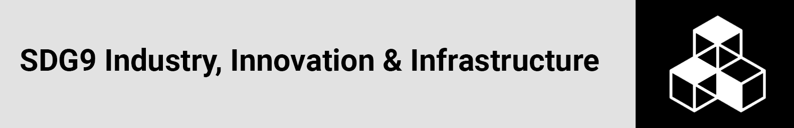

<h1 align="center">United Nations International Girls in ICT Day , 28 April 2022</a></h1>

<p align='center'>



</p>
<p align="center">
  <a href="#overview">Overview</a> •
  <a href="#Rationale and definition (SDG9c)">Rationale and Definition</a> •
  <a href="#Data Source">Data Source</a> •
  <a href="#Solution Architecture">Solution Architecture</a> •
  <a href="#networking">Networking</a> •
  <a href="#Reference">Reference</a> •
  <a href="#license">License</a>
</p>

## Overview

`April 28, 2011 : Geneva, Switzerland`

On 8 April 2011, ITU announced the establishment of an international'Girls in ICT Day', to be held every year on the fourth Thursday in April. Girls around the world gathered on 28 April 2011 to celebrate the first annual international Girls in ICT Day.

The indicator for assessing progress in ICT used as part of the SDGs in based on Sustainable Development Goal 9 which is about "industry, innovation and  infrastructure" and is one of the 17 Sustainable Development Goals  adopted by the United Nations General Assembly in 2015. SDG 9 aims to  build resilient infrastructure, promote sustainable industrialization  and foster innovation. (https://www.itu.int/women-and-girls/girls-in-ict/home/history/)


> **Mobile broadband subscriptions per 100 inhabitants, by urban/rural SDG 9.c** Significantly increase access to information and communications technology and strive to provide universal and affordable access to the Internet in least developed countries by 2020


## Rationale and definition (SDG9c)

Broadband is a key enabling technology, and access provides economic  benefits (access to the formal economy, access to regional and global  markets for local entrepreneurs, and access to banking services); health benefits (linking health workers to national health systems); and  promotes citizen participation in government. It is projected that  within a few years the majority of the world’s population, including in  sub-Saharan Africa, will have access to mobile broadband. This indicator measures the number of mobile broadband subscriptions per 100  inhabitants. The Broadband Commission describes broadband as: (a) always on; (b) high-capacity connectivity; and (c) enabling combined provision of multiple services simultaneously.

 The ITU definition refers to access to data communications (e.g. the  Internet) at broadband downstream speeds greater than or equal to 256  Kbit/s. This indicator must be seen in conjunction with indicator 63. (https://indicators.report/indicators/i-59/)

## Data Source

**UNDP Human Development Reports**: https://hdr.undp.org/en/data (identify relevant indicators)

**UNDP API:** http://ec2-54-174-131-205.compute-1.amazonaws.com/API/Information.php (API Documentation Link/URL) - get indicator ids

**Base URL:** http://ec2-54-174-131-205.compute-1.amazonaws.com/API/HDRO_API.php/

**Parameters:**

1. `country_code` e.g. country_code = 'LSO, ZAF, GBR'
2. `indicator_id` e.g.  indicator_code='690706'
   - 69706-Expected years of schooling (years)
3. `year` e.g. year = '2020, 2019, 2017,2018'


```python
http://ec2-54-174-131-205.compute-1.amazonaws.com/API/HDRO_API.php/country_code=AGO,BWA,COM,COD,SWZ,LSO,MDG,MWI,MUS,MOZ,NAM,SYC,ZAF,TZA,ZMB,ZWE/indicator_id=46006
```

**Context: ** SADC member countries

## Solution Architecture

1. Create environment : `python -m venv luigi-venv`

2. Activate environment: `.luigi-venv/Scripts/activate`

3. Create Luigi task:  `nano main` or `touch main`

   ```python
   import luigi
   
   #mixin:In object-oriented programming languages, a mixin (or mix-in)is a class that contains methods for use by other classes without having to be the parent class of those other classes.
   
   class HelloLuigi(luigi.Task):
       def output(self):
           return luigi.LocalTarget('hello-luigi.txt')
   
       def run(self):
           with self.output().open("w") as outfile:
               outfile.write("Hello Luigi!")
   ```

4. Running a Luigi task: `python -m luigi --module ScriptFileName className --local-scheduler`

- Identify the relevant ***indicator/s***

  **Mobile phone subscriptions (per 100 people)**
  **Dimension:** Mobility and communication
  **SDG 9.c** Significantly increase access to information and communications technology and strive to provide universal and affordable access to the Internet in least developed countries by 2020
  **Definition:** Number of subscriptions for the mobile phone service, expressed per 100 people.
  **Source:** ITU (International Telecommunication Union) (2020). ICT Facts and Figures 2020. www.itu.int/en/ITU-D/Statistics/Pages/stat/. Accessed 2 September 2020.

  ​	

- **Create your analysis plan**

  1. Find out if there is progress in the number of subscriptions to mobile phone services in SADC countries, because it is through mobile phones that most people in developing countries access information and the internet.

  2. ***Check for the yearly data completeness***

  3. ***Evaluate the trends in the identified indicators***

     

- **Develop your ETL Pipeline**

  - **Extraction**

    **Installation libraries:** 

    - `luigi` scheduler package for running batch processes (simple test implementation, full capabilities not explored)
    - `requests` sends HTTP requests to obtain response object data (usually loaded as a json response)
    - `pandas` manages the data manipulation (transformation)
    - `json` json encoder for python data structures (dataframes)
  
  - **Transformation**
  
    **Use Pandas to perform the transformation**
  
    ```python
    #Refer to main.py
    ```
  
    **Reference: ** <a href="02_ETL Architecture/main.py" target="_blank">main.py</a>
  
  - **Transform + Load (PowerBI)**
  
    - Use the above script to load the data into a single data frame (data_unpivot), which gets loaded as a query/table in PowerBI
    
    - Perform the following transformation steps using M-query language
    
      ```python
      #01 expand the value column from the loaded data frame to pull in the data table 
      = Source{[Name="data_unpivot"]}[Value] 
      
      #02 remove the last 3 columns containing the indicator meta descriptions
      = Table.RemoveLastN(data_unpivot1,3)
      
      #03 reordered columns
      = Table.ReorderColumns(#"Changed Type",{"iso3", "indicator_code", "value", "year"})
      
      #04 replaced comma, with period to accomodate the locale region setup for text to number conversion
      = Table.ReplaceValue(#"Reordered Columns",".",",",Replacer.ReplaceText,{"value"})
      = Table.TransformColumnTypes(#"Replaced Value",{{"value", type number}})
      
      #05 remove every null data point using the year column
      = Table.SelectRows(#"Changed Type1", each ([year] <> null))
      ```
      
  


## Networking

Connecting and building networks is always part of our  priorities, please reach out if you have any ideas on collaborative  efforts or any suggestions on ways we could improve our work:

> **Tebello Mokhele, Revenue Assurance Specialist**
>
> LinkedIn - https://www.linkedin.com/in/tebello-mokhele-25009b98/

> **Lehlohonolo Makoti, Data Management and Analytics Specialist **
>
> LinkedIn - https://www.linkedin.com/in/lehlohonolomakoti/

> **Tsepo Thoabala, Software Engineer**
>
> LinkedIn - https://www.linkedin.com/in/tsepo-makhupane-a9a74b16/


## Reference 

- **Highly Recommended** - https://pandas.pydata.org/pandas-docs/stable/getting_started/index.html
- https://indicators.report/indicators/i-59/
- https://www.integrate.io/blog/comparison-of-the-top-python-etl-tools/
- https://www.makeuseof.com/best-python-etl-tools/
- https://content.techgig.com/technology/top-5-python-based-etl-tools-to-learn-in-2020/articleshow/74489069.cms
- https://hevodata.com/learn/python-etl-tools/
- https://www.digitalocean.com/community/tutorials/how-to-build-a-data-processing-pipeline-using-luigi-in-python-on-ubuntu-20-04


## License

This license lets others distribute, remix, adapt, and build upon your  work, even commercially, as long as they credit you for the original  creation. This is the most accommodating of licenses offered.  Recommended for maximum dissemination and use of licensed materials. (https://creativecommons.org/licenses/)

****
